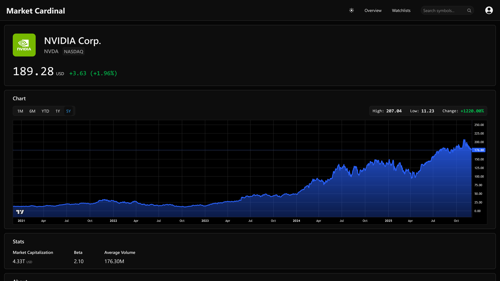
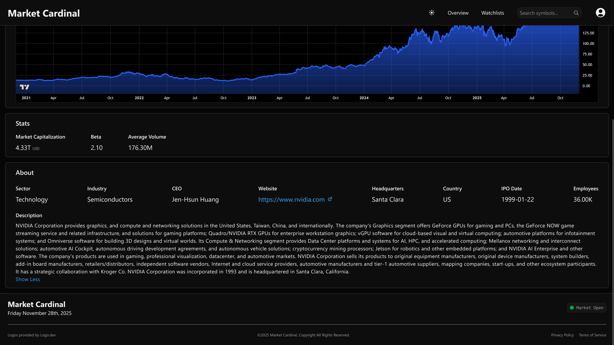

# Market Cardinal

A modern financial news and market data platform that aggregates headlines from trusted sources and delivers real-time stock information. Features include personalized user watchlists and simple asset insights. Inspired by [TradingView](https://www.tradingview.com/).

Link: https://www.marketcardinal.com/

Market Cardinal is split up into three seperate deployables, a web client, a Supabase backend, and a simple WebSocket server.

**Note**: The WebSocket server is currently offline due to hosting (Railway) free tier restrictions. Live price data is currently paused.

## How It's Made

**Tech Used:** React, TailwindCSS, JavaScript, Node.js, Supabase

I chose React and TailwindCSS for my frontend as they are highly compatible and easy to get started with.

I chose Supabase to provide me with a PostgreSQL database and to take advantage of it's strong features such as authentication, realtime updates, and edge functions. In particular, I used edge functions to fetch news articles from publicly available RSS feeds using cron jobs. These features allowed me to avoid the complexities of implementing an entire backend and focus on building my idea.

I leveraged PostgreSQL in order to implement the watchlist feature, allowing users to create and populate custom watchlists. This was done by implementing two seperate related tables.

Using Node.js, I was able to create a simple server to subscribe to [Alpaca's](https://alpaca.markets/) websocket API, updating select assets in my database in batches every second while the stock market is open. As the asset records are updated in the database via the server, the changes are broadcasted to the frontend and displayed to the user with minimal latency.

## Lessons Learned

One significant roadblock I encountered was persisting state throughout the entire application, such as selected watchlist and respective watchlist assets. Considering this was my first time building a project with React, I had to figure out how to store important state globally.

Another instance was determining how and when to fetch price data for the user without unnessesary API calls or database queries. I opted to maintaining 30 default tickers that are constantly being updated, and polling for any other assets visible to the user. Static data (eg. company info) is stored in the database after intial fetch to avoid rate limits.

## Optimizations

As touched on above, I opted to feed my database using a single WebSocket server and broadcast any updates to the frontend instead of having each active user open up a connection. This was done primarily to work around the API free tier restrictions.

I created simple cron jobs for database maintenance, deleting old records that won't be needed. While PostgreSQL can handle millions of records, I opted to remove any unused data where possible.

## Roadmap

- Daily/weekly market summaries

- Add crypto prices and charts

- News feed personalization

- Advanced watchlist insights

## Screenshots

## Authors

- [@shaynelachapelle](https://github.com/shaynelachapelle)
