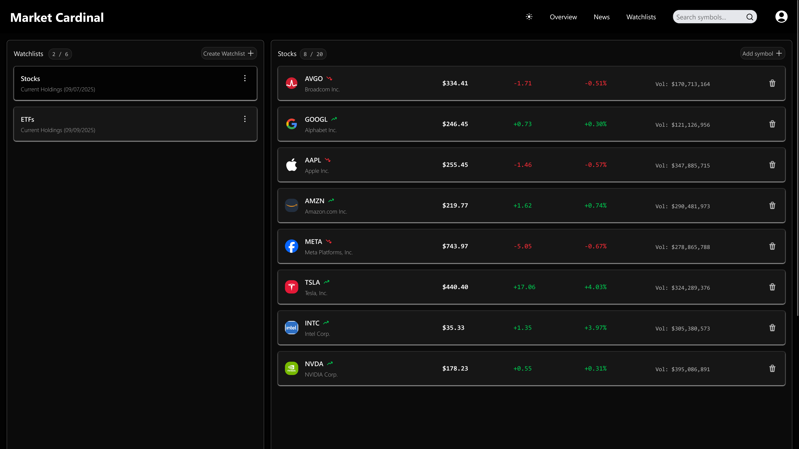
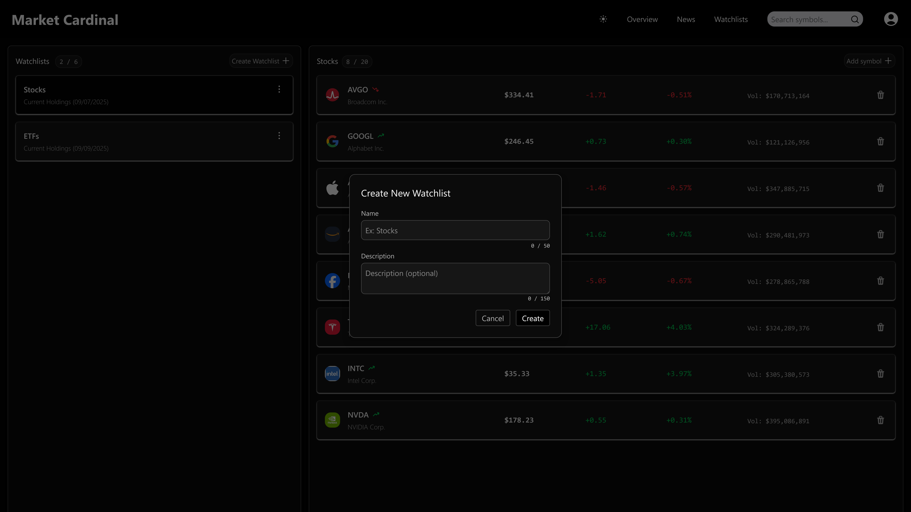
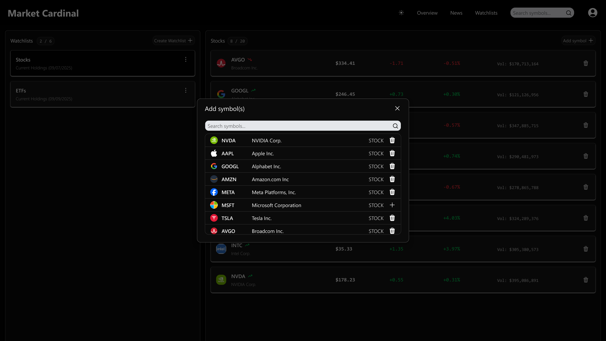
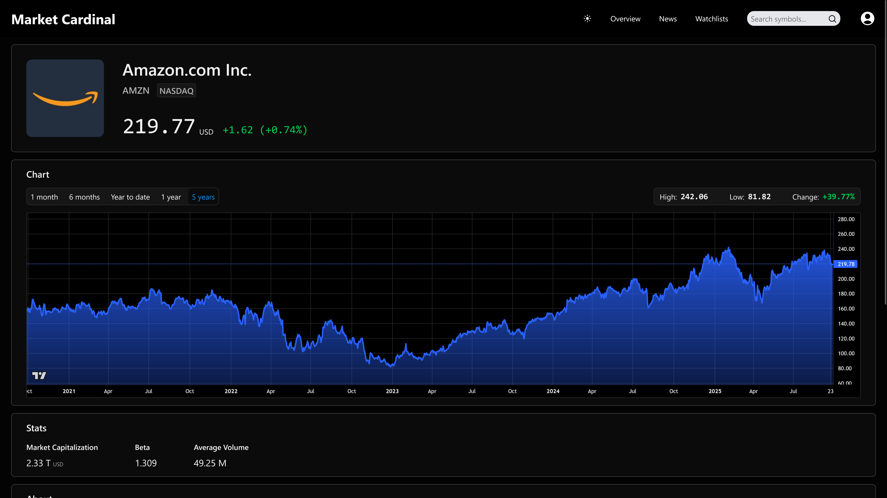
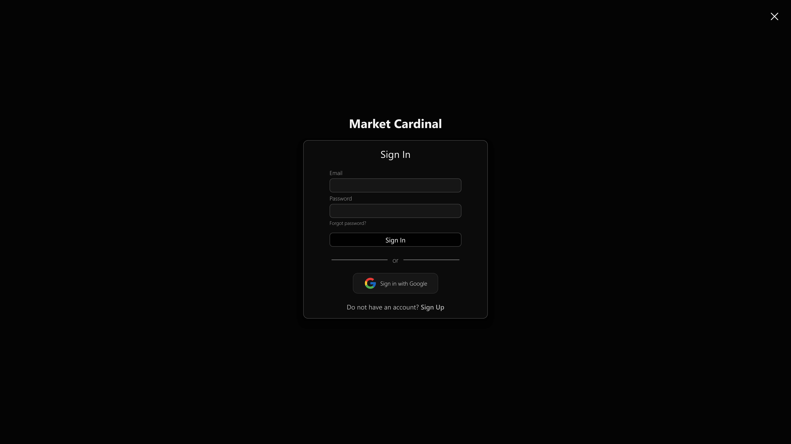

# Market Cardinal 📈

A modern financial news and market data platform that aggregates headlines from trusted sources and delivers real-time stock information.

Designed for both active investors and curious beginners, it offers a clean, user-friendly interface to stay informed on market trends, company updates, and key financial events.

## Tech Stack 💻

- **Frontend:** React, TailwindCSS, HTML/CSS
- **Backend:** Supabase (PostgreSQL, Edge Functions, Authentication, Realtime), Node.js
- **Languages:** JavaScript

## Screenshots 📷

## Authors ✏️

- [@shaynelachapelle](https://github.com/shaynelachapelle)
